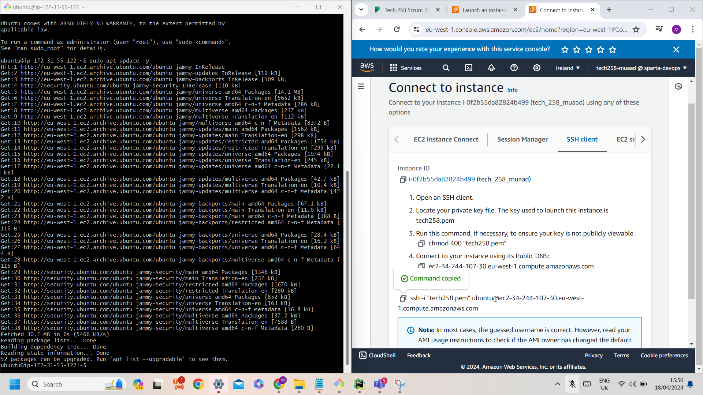

# Deploying Virtual Machine

## 1. Go to the EC2 Dashboard
- Log in to AWS Web Console
- Navigate to the EC2 Dashboard
- Launch EC2 Instance
## 2. Select Machine Image
Machine Images (AMIs) in AWS are pre-configured templates for virtual servers, defining the OS, software, and settings. They serve as the foundation for launching EC2 instances, streamlining setup and ensuring the necessary environment for your application.

## 3. Configure Network Settings
Security Groups in AWS are like virtual firewalls for EC2 instances, regulating inbound and outbound traffic based on rules. Ports are numerical endpoints used for communication between computers, each associated with specific protocols to manage network traffic. Port 80 is commonly used for HTTP web traffic, while port 22 is used for SSH connections.


## 4. Check Your Summary to Ensure Everything is Correct
Make sure the AMI and the network setting configured are correct


## 5. Open Your Created Instance

## 6. Connect to Your Instance and Configure SSH
- SSH keys are secure cryptographic keys used for authentication. We use them to securely connect to our EC2 instance, eliminating the need for passwords and ensuring a safe connection.
- Run the commands 
```bash
chmod 400 "tech258.pem"
ssh -i "tech258.pem" ubuntu@ec2-34-244-107-30.eu-west-1.compute.amazonaws.com
```

## 7. Run `sudo apt update -y`
- "sudo apt update -y" ensures that your system is up to date with the latest package information, which is essential for maintaining system security and stability. 
- -y allowing the update process to proceed without requiring manual confirmation

- 
## 8. Run `sudo apt upgrade -y`
 - sudo apt upgrade -y, it automatically upgrades all installed packages on your system to their latest available versions without asking for confirmation.
 - -y allowing the update process to proceed without requiring manual confirmation


## 9. Create Nginx
 - Nginx is a powerful web server and reverse proxy server known for its high performance, stability, and scalability. It is commonly used to serve and manage web applications, handling a large volume of concurrent connections efficiently. 
 - AWS provides EC2 instances, virtual servers in the cloud, where Nginx can be deployed.The combination of AWS and Nginx ensures reliable and high-performance web hosting in the cloud.


## 10. Check If It's Running
```bash
systemctl status nginx
```

## 11. Get the Public IP

## 12. Open Nginx

